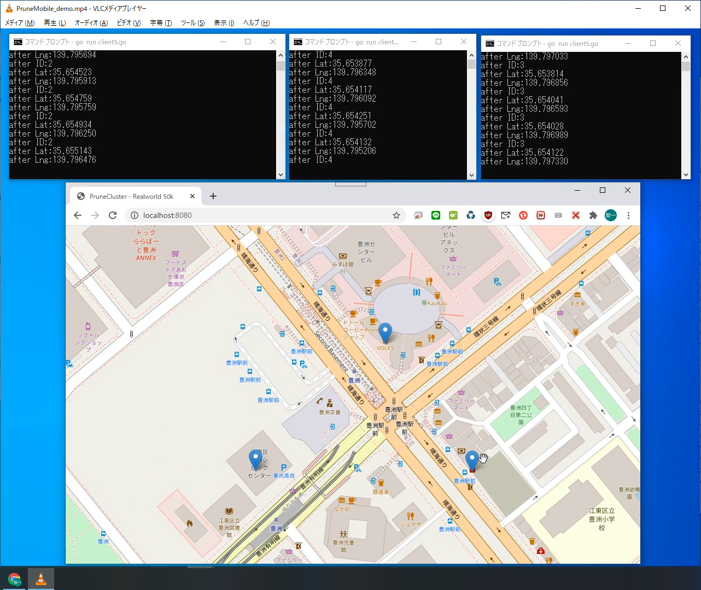

# PruneMobileとは

複数の人間や自動車等の移動体のリアルタイムの位置情報を、地図上に表示する、
PruneCluster https://github.com/SINTEF-9012/PruneCluster
のアプリケーションです。

PruneMobileに対して、任意のタイミングで位置情報(JSON形式)を送り込むだけで、地図上にマーカーが表示されます。

## 使用環境

- golang(Go言語)のインストールされていれば良いです。私(江端智一)の環境では以下のようになっています。
```
$ PruneMobile\server>go version
$ go version go1.14 windows/amd64
```

- 実際に動かせば、コンパイラから、あれこれ言われますので、それに対応して下さい。基本的には、
```
$ go get github.com/gorilla/websocket
```
は必要になると思います。

## サンプルプログラムの環境

- Webブラウザで表示される地図は、東京都江東区の豊洲駅を中心にして作ってあります。
  - PruneMobile\server\serverX.go (Xは数字) の中にある、
```
var map = L.map("map", {
   attributionControl: false,
   zoomControl: false
}).setView(new L.LatLng(35.654543, 139.795534), 18);
```
の"35.654543, 139.795534"の座標を変更すれば、地図の中心位置が変わります。

- クライアントプログラムでは、豊洲駅を中心にランダムウォークさせています
  - PruneMobile\server\clientX.go (Xは数字)を起動すると、10秒間程、マーカーが移動して、その後消滅します。

- クライアントプログラム(clientX.go)は複数同時に起動させることができます。

## 現時点で確認している問題点で、いずれ直すもの

- ~~マーカーの消滅のタイミングが、同時になってしまう

- ~~Webブラウザの表示が、最初の1つめしか、正常に動作しない

- ローカルのjs(javascript)のローディングに失敗した為、江端のプライベートサーバ(kobore.net)からローディングしている。PruneMobile\server\serverX.goの以下を参照
```
	<script src="http://kobore.net/PruneCluster.js"></script>
	<link rel="stylesheet" href="http://kobore.net/examples.css"/>
```

# サンプルプログラムの動作方法

## Step 1 サーバの起動

適当なシェルを立ち上げて
```
$ cd PruneMobile\server
$ go run serverX.go (Xは数字)
```
とすると、「Windowsセキュリティの重要な警告(windows10の場合)」が出てくるので、「アクセスを許可する」ボタンを押下して下さい。

## Step 2 ブラウザの起動
Chromoブラウザ(他のブラウザのことは知らん)から、
```
http://localhost:8080/
```
と入力して下さい。豊洲地区の地図が表示されます。

## Step 3 クライアントの起動
適当なシェルを立ち上げて
```
$ cd PruneMobile\client
$ go run clientX.go (Xは数字)
```
とすると、マーカが0.5秒単位でランダムに動きます。

## 動作の様子



# クライアントプログラムで使うI/F(データ形式)

## 前提

- サーバとwebsocketのコネクションを確立して下さい。方法は問いません。golangでの記述方法はclient/clientX.goを参考にして下さい。

- データ形式はJSONを用います。golangでの記載サンプルは以下の通りです。

```

// GetLoc GetLoc
type GetLoc struct {
	ID  int     `json:"id"`
	Lat float64 `json:"lat"`
	Lng float64 `json:"lng"`
	//Address string  `json:"address"`
}
```

## Step.1 マーカーの登録

IDを"0"にして、最初のマーカーの座標を入力したJSONを、サーバに送付して下さい。golangでの送信方法はは以下の通りです。
```
	gl := GetLoc{
		ID:  0,
		Lat: 35.653976,
		Lng: 139.796821,
	}

	err = c.WriteJSON(gl)
	if err != nil {
		log.Println("write:", err)
	}
```

返り値に入ってきたIDが、これからそのマーカで使うID番号となります。golangでの受信方法はは以下の通りです。

```
	gl2 := new(GetLoc)
	err = c.ReadJSON(gl2)
	log.Printf("after ID:%d", gl2.ID)
	log.Printf("after Lat:%f", gl2.Lat)
	log.Printf("after Lng:%f", gl2.Lng)
```

以後、このID番号(整数)を使用して下さい。この番号と異なる番号を使用した場合、動作は保証されません。

## Step.2 マーカーの移動

指定されたIDを使って、移動後の座標を送付して下さい。
```
	gl := GetLoc{
		ID:  5,         // IDが"5"の場合
		Lat: 35.653923,
		Lng: 139.796852,
	}

	err = c.WriteJSON(gl)
	if err != nil {
		log.Println("write:", err)
	}
```
返り値は、入力と同じJSONが戻ってきますが、必ず受信して下さい。
```
	gl2 := new(GetLoc)
	err = c.ReadJSON(gl2)
	log.Printf("after ID:%d", gl2.ID)
	log.Printf("after Lat:%f", gl2.Lat)
	log.Printf("after Lng:%f", gl2.Lng)
```

## Step.3 マーカーの抹消

指定されたIDを使って、地球上の緯度経度の数値で現わせない座標を入力して下さい。具体的に、latに90.0より大きな値、またはlngに180より大きな値を入力することで、マーカが消去されます。
```
	gl := GetLoc{
		ID:  5,         // IDが"5"の場合
		Lat: 999.9,
		Lng: 999.9,
	}

	err = c.WriteJSON(gl)
	if err != nil {
		log.Println("write:", err)
	}
```
返り値は、入力と同じJSONが戻ってきますが、必ず受信して下さい。
```
	gl2 := new(GetLoc)
	err = c.ReadJSON(gl2)
	log.Printf("after ID:%d", gl2.ID)
	log.Printf("after Lat:%f", gl2.Lat)
	log.Printf("after Lng:%f", gl2.Lng)
```

以上

